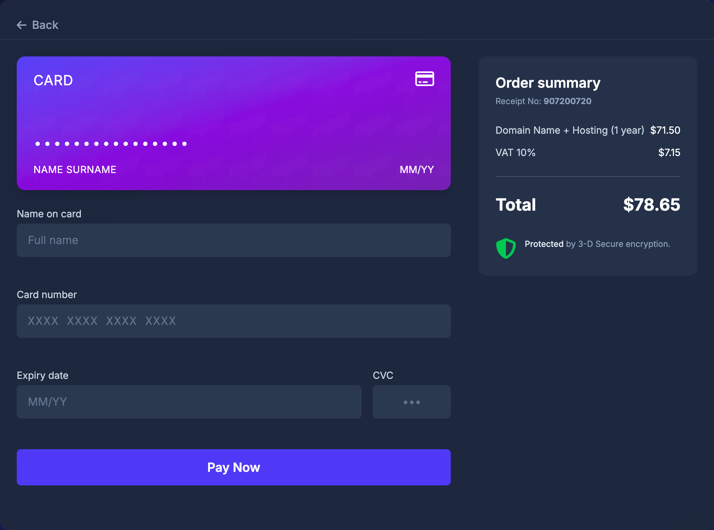

# Credit Card Checkout - Daily UI #004

An elegant, secure and interactive credit card checkout interface with real-time validation, designed and developed as part of the Daily UI challenge.



## Features

- **Real-time Card Preview**: See your card details update as you type
- **Live Input Validation**: Immediate feedback on card information
- **Auto Card Type Detection**: Automatically identifies card type (Visa, Mastercard, etc.)
- **Responsive Design**: Works on all device sizes
- **Keyboard Accessibility**: Fully navigable using keyboard
- **Screen Reader Support**: Compatible with assistive technologies

## Technologies Used

- HTML5 & CSS3 (via Tailwind CSS)
- JavaScript (ES6+)
- SVG for card icons and UI elements
- Web Accessibility standards

## Development

This project uses a modular JavaScript architecture with:

- Form validation system
- Dynamic card UI manager
- Event handling system
- Helper utilities for card detection and formatting

## Usage

Just clone the repository and open `index.html` in a browser, or use a local server:

```bash
# Using npm's http-server (if installed)
npx http-server

# Or using Python's built-in server
python -m http.server
```

## Credits

Designed and developed by [Uğur Toprakdeviren](https://github.com/toprakdeviren)

Part of the [Credit Card Checkout](https://toprakdeviren.github.io/04-credit-cardicheckout) collection.

## License

MIT License - feel free to use and modify for your own projects.
